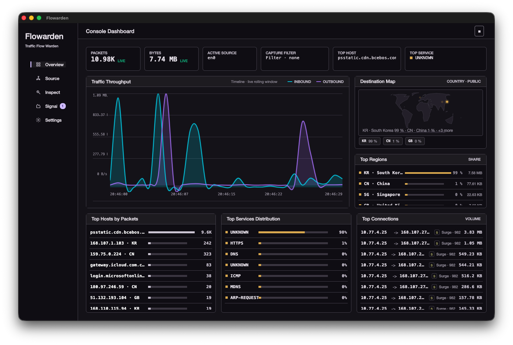
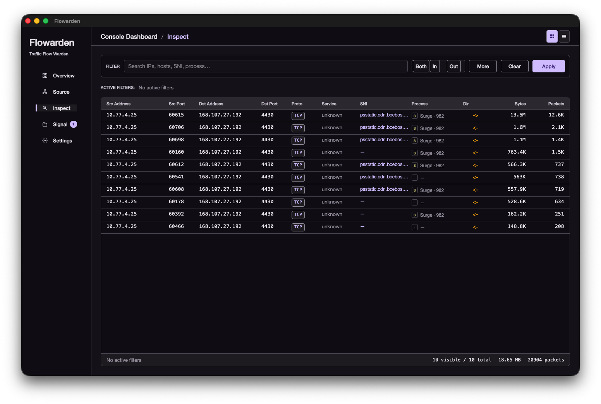
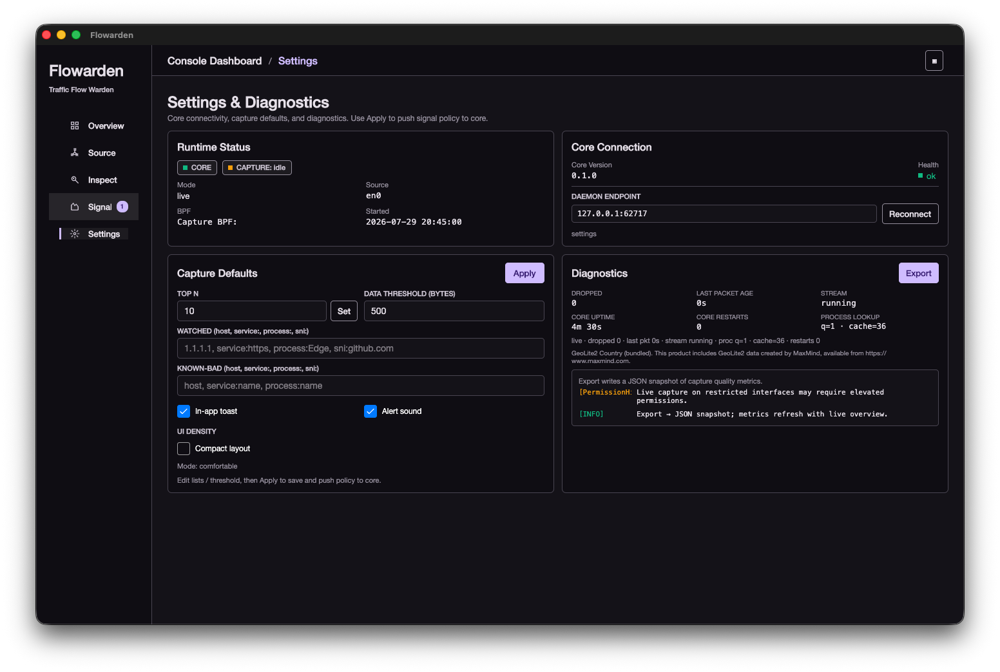
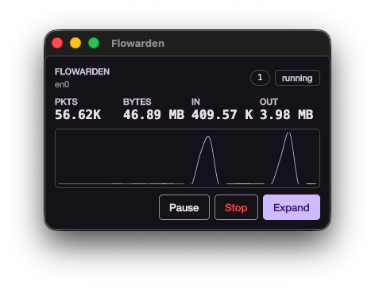

# Flowarden

Desktop network traffic monitor: live capture and offline pcap replay, ranked hosts/services/connections, destination geography, process attribution, TLS SNI, and policy-driven signals — with a headless Rust core and an Avalonia UI.

**Stack:** Rust analysis core · local gRPC · Avalonia (.NET 8) UI · CLI with the same projection contract.

---

## Screenshots

| Overview | Source |
| --- | --- |
|  |  |

| Inspect | Signals |
| --- | --- |
|  |  |

| Settings | Thumbnail |
| --- | --- |
|  |  |

---

## Features

### Capture & analysis
- Live capture from a selected interface, or offline replay of pcap/pcapng
- Optional capture-time BPF (applied at session start)
- Shared pipeline for live and offline: decode, direction, service labels, per-second aggregation
- ARP, TCP/UDP/ICMP, TLS ClientHello **SNI**, local process name/PID (async, non-blocking)
- Resident mode with bounded memory for long-running sessions
- Optional raw pcap write-out during capture

### Desktop console
- **Source** — device list, short preview samples, start / pause / resume / stop
- **Overview** — throughput chart (in/out), status cards, destination map + top regions, top hosts / services / connections
- **Inspect** — filter-first workbench: instant search, direction, structured filters, removable chips; flows and TCP tables
- **Signals** — threshold, watched, and known-bad entities; unread badge, toast/sound, pivot into Inspect
- **Settings** — Top N, signal policy, diagnostics export, UI density (comfortable / compact)
- Thumbnail always-on-top window for light monitoring
- Process icons on connection rankings (OS icons when available)

### Cross-page analysis
- One-click pivot from Overview rankings (hosts, services, connections, **regions/map markers**) into Inspect
- Offline findings can focus the timeline and rankings, then open Inspect with the same filters
- Country filter on Inspect uses host geography from the live projection

### CLI
- `devices` / `capture` with table or JSON output
- Same enrichment fields as the UI where applicable (hosts, connections, SNI, findings)
- Stable golden samples for offline regression

---

## Why Flowarden

| | |
| --- | --- |
| **Clear boundaries** | Capture/analysis stays in Rust; the UI only consumes projections. CLI and UI share one contract. |
| **Built for long runs** | Resident core, soft-capped aggregates, rolling live timeline — not an unbounded session dump. |
| **Analyst workflow** | Filters, chips, pivots, signals, and offline forensics markers — not only charts. |
| **Honest semantics** | Capture BPF vs Inspect filters are separate. Projection Top N is explicit. Process lookup is heuristic and non-blocking. |
| **Practical depth today** | Light DPI (TLS SNI) and process attribution without full IDS scope. |
| **Room to go deeper** | The core pipeline is built to grow into broader DPI and protocol detail. |

---

## Architecture

```text
┌─────────────────┐     gRPC (local)      ┌──────────────────────────┐
│  Avalonia UI    │ ◄──────────────────► │  flowarden (resident)    │
│  flowarden-ui   │   health · control   │  capture → decode → agg  │
└─────────────────┘   discovery · proj.  │  projection · signals    │
                                         └────────────┬─────────────┘
                                                      │
                                         ┌────────────▼─────────────┐
                                         │  flowarden-core          │
                                         │  devices · pcap · flow   │
                                         └──────────────────────────┘

CLI:  flowarden devices | capture …   (same core, no UI)
```

| Component | Role |
| --- | --- |
| `flowarden/` | Rust workspace: CLI, resident gRPC host, core, proto |
| `flowarden-ui/` | Avalonia desktop app |
| `docs/` | Design, phase plans, runbooks |

---

## Requirements

- **Rust** (stable) for core/CLI
- **.NET 8 SDK** for the UI (`global.json` pins the patch level)
- Capture privileges as required by your OS (e.g. BPF/pcap on macOS/Linux)
- Optional: MaxMind GeoLite2 databases under the core resources path for country/ASN enrichment (UI does not show ASN by product choice)

---

## Build

```bash
# Core + CLI
cd flowarden
cargo build --release

# Desktop UI
cd ../flowarden-ui
dotnet build Flowarden.Ui.sln -c Release
```

---

## Run

### CLI

```bash
cd flowarden

# List interfaces
cargo run -p flowarden --release -- devices
cargo run -p flowarden --release -- devices --format json

# Live capture (5s sample)
cargo run -p flowarden --release -- capture --device en0 --duration 5

# Offline pcap
cargo run -p flowarden --release -- capture --read ./sample.pcap --format json

# BPF + pcap out
cargo run -p flowarden --release -- capture --device en0 --duration 10 \
  --bpf "tcp" --pcap-out ./capture.pcap
```

### Desktop

```bash
# Prefer a release core binary on PATH or next to the UI launch config.
cd flowarden && cargo build --release -p flowarden
cd ../flowarden-ui && dotnet run --project src/Flowarden.Ui -c Release
```

The UI can start or attach to a local `flowarden core` resident process. Preferences live under the OS app data directory (`Flowarden/preferences.json`).

---

## Projection at a glance

| Surface | Contents |
| --- | --- |
| Overview snapshot | Totals, timeline, top hosts/services/connections, destinations, TCP slice, signals |
| Inspect | Filtered connection rows (process, SNI, direction, country via host map) |
| Control | Source, BPF store, start/stop/pause/resume, signal policy |
| CLI JSON | Enriched tops + optional findings under the same policy knobs |

---

## Relation to Sniffnet

Flowarden is **inspired by [Sniffnet](https://github.com/GyulyVGC/sniffnet)** — its capture-and-aggregate model, ranked views, destination map, process hints, and compact thumbnail monitoring shaped the product goals.

It is **not a fork or re-skin**. Sniffnet is a polished single-process Rust desktop app (iced). Flowarden reimplements the monitoring idea with a different architecture: a headless Rust core, an Avalonia UI over local gRPC, and a CLI that shares the same projection contract.

| | Sniffnet | Flowarden |
| --- | --- | --- |
| Form | Integrated iced GUI | Avalonia UI + resident Rust core |
| IPC | In-process | Local gRPC (control / projection) |
| CLI | Limited | First-class JSON/table capture output |
| Long runs | Solid defaults | Explicit resident bounds + tick window |
| Enrichment | Country, ASN, process, map | Country, process, **TLS SNI**, map markers; **ASN hidden in UI** (product choice) |
| Alerts | Notifications / webhooks | Signals page + policy (threshold, watch, known-bad) |
| Deep protocol / DPI | Out of scope for the reference product | **Planned expansion** on the core analysis path (beyond SNI) |

**Use Flowarden** when you want core/UI separation, scriptable capture output, Inspect-oriented filtering and pivots, or SNI/process-driven analysis on a projection pipeline — with a path toward richer DPI.

Credit to GyulyVGC and the Sniffnet community for the reference product and for proving this class of desktop monitor works well in practice.

---

## Roadmap

- **DPI expansion** — grow light DPI (TLS SNI today) into broader application-layer parsing and projection fields, still without turning Flowarden into a full IDS.
- Deeper session/forensics views and continued UX polish remain secondary to a stable core + UI contract.

---

## License

Apache License 2.0 (see license files in the repository where present).

GeoLite2 data, if you use it, is subject to MaxMind’s terms and attribution requirements.
