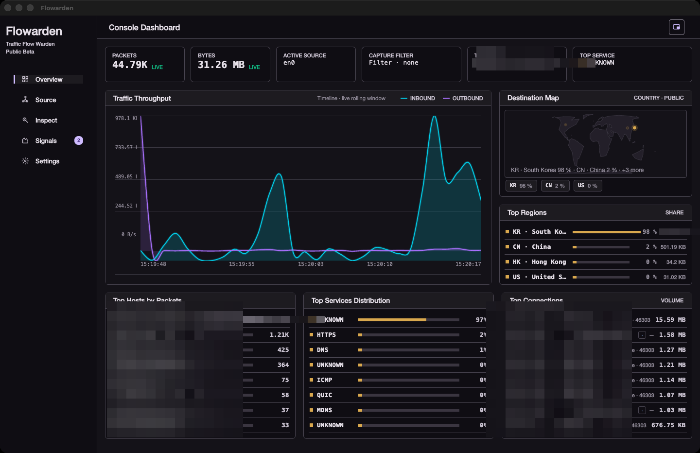
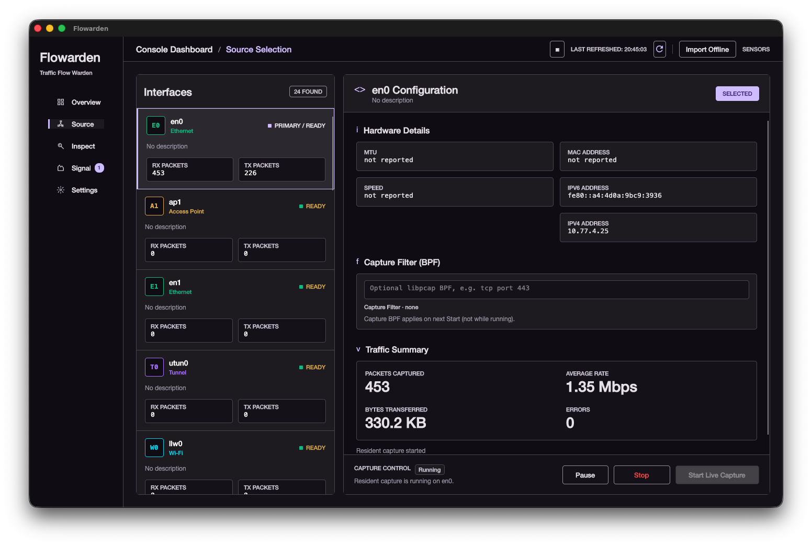
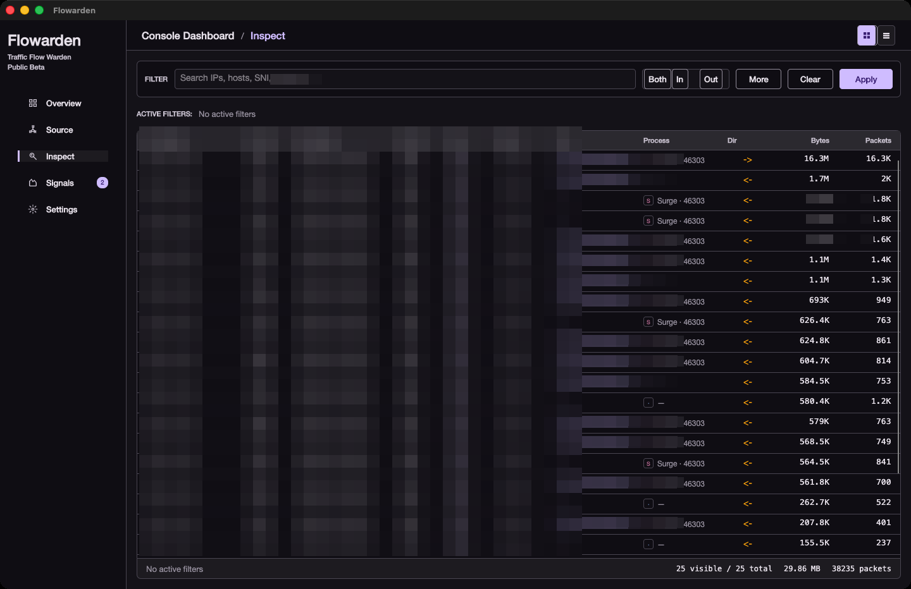
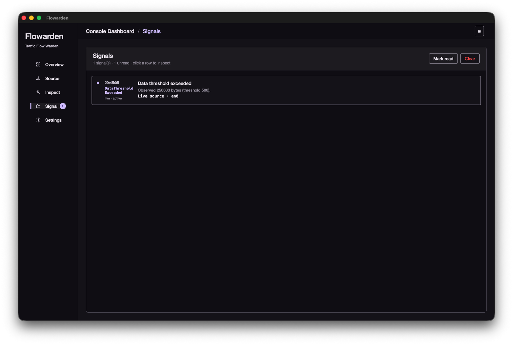
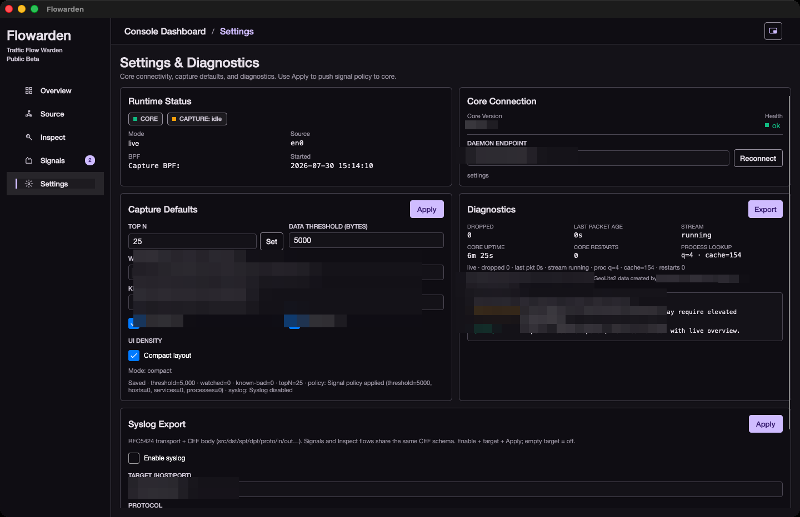
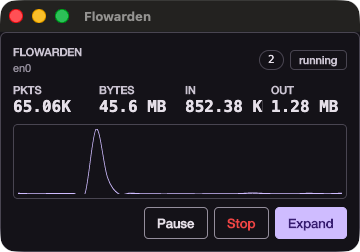

# Flowarden

[](https://github.com/jdtec-ex/flowarden-ex/actions/workflows/ci.yml)
[](LICENSE)
[](#)
[](#supported-platforms)
[](flowarden/)
[](flowarden-ui/)

**Public Beta.** Desktop network traffic monitor for live capture and pcap replay — ranked hosts, services, and connections, destination geography, process attribution, TLS SNI, behavior signals, and **RFC5424 + CEF syslog** export (signals + Inspect flows).

**Cross-platform:** Linux, macOS, and Windows. Same Rust core and Avalonia UI on all three; capture stack uses libpcap (Linux/macOS) or Npcap (Windows).

Built as a **Rust resident analysis core** with an **Avalonia (.NET 8) UI** over local gRPC, plus a **CLI** that shares the same projection contract. Inspired by [Sniffnet](https://github.com/GyulyVGC/sniffnet); not a fork.


---

## Screenshots

| Overview | Source |
| --- | --- |
|  |  |

| Inspect | Signals |
| --- | --- |
|  |  |

| Settings | Thumbnail |
| --- | --- |
|  |  |

---

## Features

### Capture & analysis
- Live capture from a selected interface, or offline replay of pcap/pcapng
- Optional capture-time BPF (applied at session start)
- Shared pipeline for live and offline: decode, direction, service labels, per-second aggregation
- ARP, TCP/UDP/ICMP, TLS ClientHello **SNI**, local process name/PID (async, non-blocking)
- **Behavior / light-DPI detectors** (Signals): data threshold, watched/known-bad entities, unidirectional large transfer (possible exfil), long-idle TCP, unauthorized P2P/proxy heuristics
- **Syslog export** (RFC5424 envelope + **CEF** body, SIEM-standard keys): signals and **Inspect flow** summaries; CLI/`core` args or Settings UI (`Get`/`SetSyslogConfig`)
- Resident mode with bounded memory for long-running sessions
- Optional raw pcap write-out during capture

### Desktop console
- **Source** — device list, short preview samples, start / pause / resume / stop
- **Overview** — throughput chart (in/out), status cards, destination map + top regions, top hosts / services / connections
- **Inspect** — filter-first workbench: instant search, direction, structured filters, removable chips; flows and TCP tables
- **Signals** — threshold, watched, and known-bad entities; unread badge, toast/sound, pivot into Inspect
- **Settings** — Top N, signal policy, diagnostics export, UI density (comfortable / compact)
- Thumbnail always-on-top window for light monitoring
- Process icons on connection rankings (OS icons when available)

### Cross-page analysis
- One-click pivot from Overview rankings (hosts, services, connections, **regions/map markers**) into Inspect
- Offline findings can focus the timeline and rankings, then open Inspect with the same filters
- Country filter on Inspect uses host geography from the live projection

### CLI
- `devices` / `capture` with table or JSON output
- Same enrichment fields as the UI where applicable (hosts, connections, SNI, findings)
- Stable golden samples for offline regression

---

## Why Flowarden

| | |
| --- | --- |
| **Cross-platform** | Runs on **Linux, macOS, and Windows** with one codebase (libpcap / Npcap + Avalonia). |
| **Clear boundaries** | Capture/analysis stays in Rust; the UI only consumes projections. CLI and UI share one contract. |
| **Built for long runs** | Resident core, soft-capped aggregates, rolling live timeline — not an unbounded session dump. |
| **Analyst workflow** | Filters, chips, pivots, signals, and offline forensics markers — not only charts. |
| **Honest semantics** | Capture BPF vs Inspect filters are separate. Projection Top N is explicit. Process lookup is heuristic and non-blocking. |
| **Practical depth today** | Light DPI (TLS SNI) and process attribution without full IDS scope. |
| **Room to go deeper** | The core pipeline is built to grow into broader DPI and protocol detail. |

---

## Architecture

```text
┌─────────────────┐     gRPC (local)      ┌──────────────────────────┐
│  Avalonia UI    │ ◄──────────────────► │  flowarden (resident)    │
│  flowarden-ui   │   health · control   │  capture → decode → agg  │
└─────────────────┘   discovery · proj.  │  projection · signals    │
                                         └────────────┬─────────────┘
                                                      │
                                         ┌────────────▼─────────────┐
                                         │  flowarden-core          │
                                         │  devices · pcap · flow   │
                                         └──────────────────────────┘

CLI:  flowarden devices | capture …   (same core, no UI)
```

| Component | Role |
| --- | --- |
| `flowarden/` | Rust workspace: CLI, resident gRPC host, core, proto |
| `flowarden-ui/` | Avalonia desktop app |
| `screenshots/` | README product screenshots |

---

## Supported platforms

| OS | Core / CLI | Desktop UI | Capture backend |
| --- | --- | --- | --- |
| **Linux** | Yes | Yes (Avalonia) | libpcap |
| **macOS** | Yes | Yes (Avalonia) | libpcap (system) |
| **Windows** | Yes | Yes (Avalonia) | [Npcap](https://npcap.com/) (WinPcap-compatible API) |

### Downloads (users)

Pre-built **portable full bundles** (self-contained UI + `flowarden` core in one archive) are published on:

**https://github.com/jdtec-ex/flowarden-ex/releases**

Release titles use **`Flowarden 0.1.*`** (starting at **0.1.0**). Git tags match the number: `0.1.0`, `0.1.1`, …

| Asset (example) | Platform |
| --- | --- |
| `flowarden-linux-x64.tar.gz` | Linux x64 |
| `flowarden-macos-arm64.tar.gz` | macOS Apple Silicon |
| `flowarden-windows-x64.zip` | Windows x64 |

Unpack, keep UI and core in the **same folder**, then start `Flowarden.Ui` / `Flowarden.Ui.exe`. Full notes are also in `README.txt` inside the package.

**After download (all platforms)**

1. Unpack the archive.
2. Do not separate the UI binary from `flowarden` / `flowarden.exe` — the UI launches core from the same directory.
3. **Windows:** install [Npcap](https://npcap.com/) first (enable WinPcap API compatibility if offered).
4. **Linux:** ensure libpcap is installed; live capture often needs elevated privileges (see below).
5. **macOS (unsigned / GitHub zip):** clear quarantine so Gatekeeper does not block the binaries (**provisional** workaround until app signing/notarization):

```bash
# From the unpacked folder
xattr -cr .
# or only the executables:
xattr -d com.apple.quarantine ./Flowarden.Ui ./flowarden 2>/dev/null || true
```

Then run `./Flowarden.Ui`. If macOS still blocks the app: System Settings → Privacy & Security → allow the blocked app, or right-click → Open.

**Privileges / `sudo` (live capture)**

- Live packet capture needs raw access to network interfaces. Offline pcap replay does **not**.
- **Linux:** you may need `sudo ./Flowarden.Ui` or `sudo ./flowarden …`, or grant capabilities instead of full root, e.g.  
  `sudo setcap cap_net_raw,cap_net_admin=eip ./flowarden`  
  Prefer capabilities over leaving the UI running as root when possible.
- **macOS:** first capture may prompt for permission; some setups still require running from a Terminal with elevated rights. Prefer the system permission dialog when it appears; use `sudo` only if capture still fails after granting access.
- **Windows:** install Npcap with admin rights once; day-to-day UI usually does not need “Run as administrator” if Npcap is installed correctly.
- **Caution:** running the whole desktop UI under `sudo`/`Administrator` increases risk. Prefer elevating only the capture backend when you can, and avoid browsing untrusted files as root.

CI (test-only) runs on Ubuntu and Windows; **Release** packages are produced for Linux, macOS, and Windows when an `0.1.*` tag is pushed.

---

## Requirements

- **Rust** (stable) for core/CLI
- **.NET 8 SDK** for the UI (`global.json` pins the patch level)
- Capture stack:
  - **Linux:** `libpcap` (e.g. `libpcap-dev`) and capture privileges as needed
  - **macOS:** system libpcap; grant capture privileges when prompted
  - **Windows:** install [Npcap](https://npcap.com/) (enable WinPcap API compatibility if offered); SDK only needed when building from source
- Optional: MaxMind GeoLite2 databases under the core resources path for country/ASN enrichment (UI does not show ASN by product choice)

---

## Build

```bash
# Core + CLI
cd flowarden
cargo build --release

# Desktop UI
cd ../flowarden-ui
dotnet build Flowarden.Ui.sln -c Release
```

---

## Run

### CLI

```bash
cd flowarden

# List interfaces
cargo run -p flowarden --release -- devices
cargo run -p flowarden --release -- devices --format json

# Live capture (5s sample)
cargo run -p flowarden --release -- capture --device en0 --duration 5

# Offline pcap
cargo run -p flowarden --release -- capture --read ./sample.pcap --format json

# BPF + pcap out
cargo run -p flowarden --release -- capture --device en0 --duration 10 \
  --bpf "tcp" --pcap-out ./capture.pcap
```

### Desktop

```bash
# Prefer a release core binary on PATH or next to the UI launch config.
cd flowarden && cargo build --release -p flowarden
cd ../flowarden-ui && dotnet run --project src/Flowarden.Ui -c Release
```

The UI can start or attach to a local `flowarden core` resident process. Preferences live under the OS app data directory (`Flowarden/preferences.json`).

---

## Projection at a glance

| Surface | Contents |
| --- | --- |
| Overview snapshot | Totals, timeline, top hosts/services/connections, destinations, TCP slice, signals |
| Inspect | Filtered connection rows (process, SNI, direction, country via host map) |
| Control | Source, BPF store, start/stop/pause/resume, signal policy |
| CLI JSON | Enriched tops + optional findings under the same policy knobs |

---

## Behavior signals

Signals are produced in the resident core (`SignalEngine`) while capture is active (or when an offline pcap finishes). The UI **Signals** page shows the same list as overview projection; syslog (if enabled) exports each new signal as CEF with `cat=signal`.

Policy comes from Settings (threshold, watched / known-bad lists) or CLI (`--data-threshold`, `--watch`, `--known-bad`). DPI-style detectors use built-in defaults unless the control API sets them. Live detectors re-fire on a cooldown so the feed does not spam; offline findings are usually once per capture session.

| Kind | What it means | Default trigger (approx.) |
| --- | --- | --- |
| `DataThresholdExceeded` | Session byte total crossed the configured ceiling | `50_000_000` bytes (Settings / CLI can lower this) |
| `WatchedEntityTransmitted` | A host, service, or process on the watch list showed traffic | Substring match on list entries; optional prefixes `service:`, `process:`, `sni:` |
| `KnownBadHostTransmitted` | Same matching as watch, against the known-bad list | Same pattern rules; severity is higher |
| `UnidirectionalLargeTransfer` | One connection is mostly outbound and large | Outbound ≥ `50_000_000` bytes and out/in ≥ `20` (heuristic for bulk upload / possible exfil) |
| `LongIdleTcpConnection` | Established TCP, old, quiet, little data | Age ≥ 1 h, no payload ≥ 10 min, total bytes ≤ 64 KiB |
| `UnauthorizedP2pOrProxy` | Port / process / SNI looks like P2P or proxy tooling | e.g. ports 1080, 3128, 6881–6889, 7890, 9050; process names like Clash, qbittorrent, tor; narrow SNI patterns |

### How the match lists work

- Watched and known-bad accept comma-separated tokens in Settings.
- Bare tokens match hosts (IP or name) and related labels by case-insensitive substring.
- Prefer explicit forms when you care about type: `service:https`, `process:Chrome`, `sni:cdn.example`.
- Process signals need process attribution on the connection (OS lookup is best-effort and async).

### How to exercise each kind

**Data threshold** — Set threshold to a small number (e.g. `1` or `1000`), Apply, then live-capture a few seconds or replay any pcap. Easiest signal to produce.

**Watched host / service / process** — Put a host you will actually talk to (or `service:https`, or `process:<browser name>`) on the watch list, Apply, generate traffic. Expect `pivot_kind` of `host`, `service`, or `process`.

**Known-bad** — Same as watch, on the known-bad list. Useful for verifying severity and UI treatment, not as a threat-intel feed.

**Unidirectional large transfer** — Defaults are high on purpose. Either upload a large file on a quiet path, or lower `dpi_exfil_min_bytes` / `dpi_exfil_ratio` via control policy when testing. Needs a connection that appears in the projected top-connections set.

**Long-idle TCP** — Defaults require hour-scale idle. For a quick check, lower `dpi_idle_min_age_secs` and `dpi_idle_silence_secs` in policy, keep a nearly silent established TCP, wait past the shortened windows. Needs TCP rows in the projection (Inspect TCP path).

**P2P / proxy** — Run something the process list knows (Clash, Transmission, …) or open traffic on a listed proxy/P2P port. Process-name hits and port hits are independent. Allow-list entries (`dpi_p2p_allow`) suppress matches you consider legitimate.

### CLI smoke check

```bash
cd flowarden
cargo run -p flowarden --release -- capture \
  --read ./flowarden-core/tests/fixtures/offline_mixed_ethernet.pcap \
  --data-threshold 1 \
  --watch service:https \
  --format json
```

Findings show up under the same kinds as the UI. For unit-level coverage of the engine:

```bash
cargo test -p flowarden watched_ offline_finding
```

### Syslog

With syslog enabled (`--syslog-target` or Settings), each signal is one RFC5424 line whose MSG is CEF. Signature ID equals the kind string; extension `cat=signal` separates them from flow lines (`cat=traffic`).

### Limits worth knowing

- Only entities that make it into the current projection tops / TCP slice can fire host/service/connection detectors.
- Cooldowns: roughly 30 s for threshold (live), 20 s per watched/bad entity, 60 s for DPI kinds.
- Starting a new capture clears the signal session.
- A UI-only fallback threshold (when the core returns no signals) does **not** go to syslog; trust the core list for export.

---

## Relation to Sniffnet

Flowarden is **inspired by [Sniffnet](https://github.com/GyulyVGC/sniffnet)** — its capture-and-aggregate model, ranked views, destination map, process hints, and compact thumbnail monitoring shaped the product goals.

It is **not a fork or re-skin**. Sniffnet is a polished single-process Rust desktop app (iced). Flowarden reimplements the monitoring idea with a different architecture: a headless Rust core, an Avalonia UI over local gRPC, and a CLI that shares the same projection contract.

| | Sniffnet | Flowarden |
| --- | --- | --- |
| Form | Integrated iced GUI | Avalonia UI + resident Rust core |
| IPC | In-process | Local gRPC (control / projection) |
| CLI | Limited | First-class JSON/table capture output |
| Long runs | Solid defaults | Explicit resident bounds + tick window |
| Enrichment | Country, ASN, process, map | Country, process, **TLS SNI**, map markers; **ASN hidden in UI** (product choice) |
| Alerts | Notifications / webhooks | Signals + policy + **behavior detectors** (exfil / idle TCP / P2P-proxy) |
| Syslog | — | **RFC5424 + CEF** signal + traffic flow export (CLI + Settings) |
| Deep protocol / DPI | Out of scope for the reference product | Light DPI + heuristics now; **deeper protocol DPI planned** |

**Use Flowarden** when you want core/UI separation, scriptable capture output, Inspect-oriented filtering and pivots, SNI/process context, syslog integration, or an extensible DPI path.

Credit to GyulyVGC and the Sniffnet community for the reference product and for proving this class of desktop monitor works well in practice.

---

## Roadmap

- **Deeper DPI** — beyond SNI + behavioral heuristics: richer application-layer parsing and projection fields, without becoming a full IDS.
- Deeper session/forensics views and continued UX polish remain secondary to a stable core + UI contract.

---

## License

Apache License 2.0 (see license files in the repository where present).

GeoLite2 data, if you use it, is subject to MaxMind’s terms and attribution requirements.
