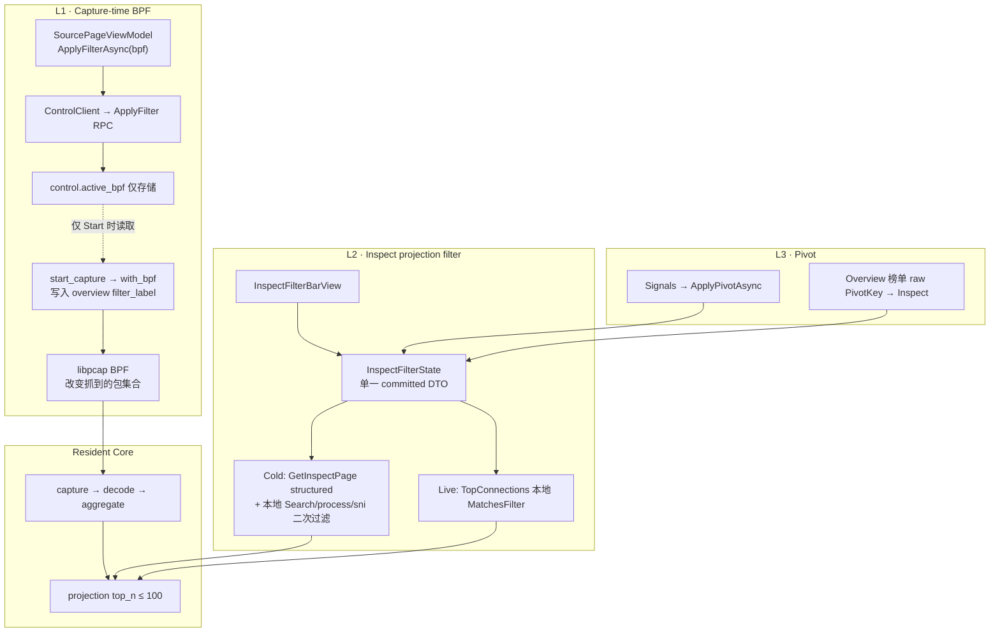
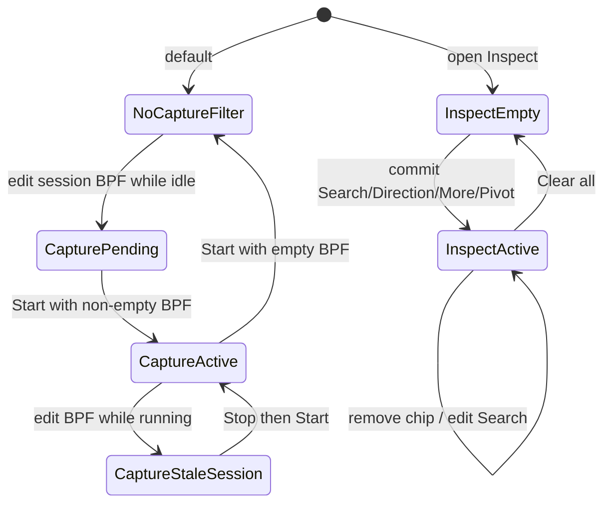
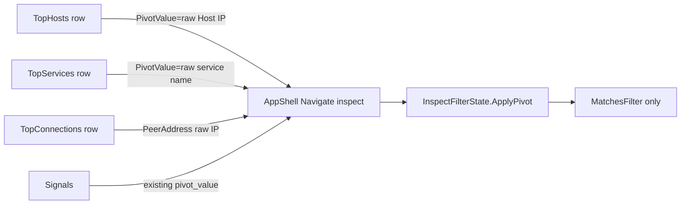
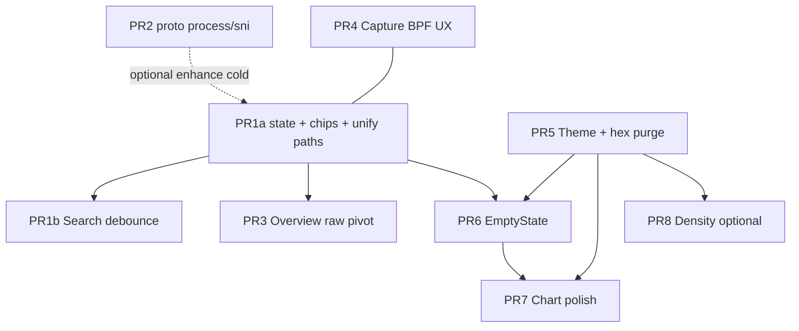

# Flowarden UX：过滤 UX + 视觉 Polish 方案设计

| 字段 | 内容 |
| --- | --- |
| 文档标题 | Filter UX + Visual Polish Design |
| 作者 | Flowarden UI / Core |
| 日期 | 2026-07-29 |
| 修订 | 2026-07-29 r2.1 — residual pivot/footer/chart/summary nits |
| 状态 | Implemented (2026-07-29) — PR1a–7 in main workspace; PR8 density deferred |
| 范围 | 桌面端 Avalonia UI + 必要的 projection/proto 增量；不重做产品架构 |
| 相关 | `docs/sniffnet_gap_2026-07.md`、`docs/phase2/flowarden_phase2_ui_gap_analysis.md`、`docs/phase2/stitch_flowarden_network_monitoring_*/DESIGN.md` |

---

## Overview

Phase1–3 已交付抓包、projection、Inspect、Signals、ARP/SNI/Process 主路径；与 Sniffnet 的剩余差距集中在**过滤/搜索组合手感**与**视觉/交互 polish**（见 `docs/sniffnet_gap_2026-07.md` §4.1、§5 P1/P3）。本文给出两套可直接拆 PR 的体验收口方案：

1. **Filter UX** — 三层过滤信息架构清晰化；Inspect 升级为「统一搜索 + 结构化条件 + 可移除 chips」工作台；跨页 pivot 统一且**始终使用 raw projection keys**；process/sni 为一等维度（country v1 仅 experimental）。
2. **Visual Polish** — 在现有 TFC token（`Theme.axaml` / `Controls.axaml`）上收口层次、密度、图表、空态/加载/错误组件，禁止 VM 硬编码色。

原则：**UI 只消费 projection；采集 BPF 仅在 Start 生效；不引入 query language；不混用 BPF 与 Inspect 语法；Inspect 过滤窗口 = projection TopN（≤100）；不做 Phase4 DPI；UI 不展示 ASN。**

---

## Background & Motivation

### 当前架构（必须尊重）



| 层 | 作用 | 现状入口 | Core 路径 | 生效时机（已核实） |
| --- | --- | --- | --- | --- |
| **L1 Capture BPF** | 改变抓到的包集合 | `SourcePageViewModel` Start 前 `ControlClient.ApplyFilterAsync`；`filter_label` 在 overview meta | `flowarden/src/service/bpf.rs`、`control.rs::apply_filter`（**只写** `active_bpf`）、`start_capture` → `with_bpf`、`state.rs::filter_label` | **仅 Start（及 set_source 空快照 stamp）**；运行中 ApplyFilter **不** recompile pcap、**不**推新 `filter_label` |
| **L2 Inspect filter** | 在已投影 TopN 集合上筛结果 | `InspectFilterBarView` + `InspectPageViewModel`；需 **Apply** | `convert.rs::inspect_row_matches_filter`（**忽略** request.bpf）；`PROJECTION_MAX_TOP_N = 100` | 用户 Apply / 本方案 debounce |
| **L3 Pivot** | 从 Signals/榜单一键聚焦 | `ApplySignalPivotAsync`；sni/process 塞进 `BpfInput` 伪 token | 主要 UI 本地 | 立即，但当前与 live 路径**互斥**（见痛点） |

### 已知痛点（对照代码）

**过滤**

1. **心智未分层**：header/Settings 显示 capture BPF（`Filter · {bpf}`），Inspect 又有名为 “Bpf” 的字段且 watermark 写 “Last 5m”（`InspectFilterBarView.axaml` L27），实际绑定 `BpfInput` 并承载 free-text / sni / process。
2. **Destination 伪装成全局搜索**：`DestinationAddressInput` watermark 为 **“Search IPs, hosts...”**，但只做 `destination_address` contains；真正的多列 free-text 藏在 Bpf 框。合并 Search 是 **Bpf free-text 的正名**，不是 Destination 的重命名。
3. **无 Sniffnet 风格统一搜索**：多 TextBox + Apply；Direction 立即生效（`ApplyDirectionCommand`），其余字段要 Apply — 不一致。
4. **Chips 弱**：`ActiveFilterChips` 为 `ObservableCollection<string>`，UI 画了 “x” 但**不可点删**（`InspectPageView.axaml`）。
5. **Pivot / live / cold 三路径分裂**：
   - `ApplyLiveOverviewToInspect`：若 `_activeSignalPivotKind` 非空，**只**跑 `FilterRowsByPivot` 并 return，**跳过** `MatchesFilter`（结构化条件被 sticky pivot 吃掉）。
   - `ApplySignalPivotAsync`：`ApplyFilters()` 后再 `ApplyLocalPivotFilter`，双重应用并覆盖 chips 为单一 `kind:value`。
   - Cold `ReloadAsync`：`GetInspectPage` 返回后**不再**本地 free-text/process/sni 过滤（Bpf 杂物袋主要靠下次 live tick 的 `MatchesFilter`）。
6. **Footer 语义错误**：`BuildSummary` / `ProjectionClient` 将 `TotalRows = VisibleRows = filtered.Length`，过滤后永远 `N visible / N total`。
7. **无 Overview → Inspect pivot**：榜单行无点击；且行 VM **只有 display Label**（SNI/rDNS/country 装饰后的字符串），即使用 Label 做 pivot 也会 miss/over-match。
8. **一等维度缺失**：core 忽略 `bpf`；process/sni 仅 UI 伪 token；country 在 Host 有、Connection 无。
9. **Source BPF 编辑 UX 不足**：`CurrentSession.Bpf` 存在，Source XAML **无可见 BPF 编辑框**。
10. **工作集误解风险**：Inspect 只看见 projection **TopN≤100** 窗口，不是全量 capture 流表。

**视觉**

1. Token 已齐，卡面偏平；`glass-panel` 与 `tfc-panel` 差异弱。
2. Mode 按钮等 VM 硬编码 hex：`InspectPageViewModel.FlowModeBackground => "#CFBCFF"`；`SourceDeviceItemViewModel` / `OverviewRankingsBuilder` 等也有 hex。
3. 空态分散；Hero chart 缺 fill/glow/stale；表无 hover/selected。

### 产品决策（约束）

- UI **不展示 ASN**。
- 不引入复杂 query language（第一版）。
- 不把 BPF 与 Inspect filter 混成一种语法。
- 质量门禁：`cargo test` / clippy、`dotnet build` 仍适用。

---

## Goals & Non-Goals

### Goals

**A. Filter UX**

1. 用户能明确区分：**Capture BPF（少抓，Start 生效）** vs **Inspect filter（少看，TopN 窗口）** vs **Pivot（写入 Inspect chips）**。
2. Inspect 成为 filter-first workbench：统一 Search（即时 debounce）+ Direction 即时 + More 结构化（v1 显式 Apply）+ 可移除 chips。
3. **process / sni 作为一等 filter 维度**；country 为 v1 **experimental**（见 A.6），不作为必达验收。
4. Overview Top Hosts / Services / Connections 一键 pivot；**PivotValue 永远是 raw projection key**。
5. Source 可编辑 capture BPF；全局可见；文案诚实（运行中更改 → next Start）。
6. 0 命中可操作空态；footer **visible ≠ total** 语义正确。
7. **单一 filter 应用算法**：live / cold / pivot 共用 committed `InspectFilterDto` + `MatchesFilter`（及 cold 结构化 RPC）。

**B. Visual Polish**

1. TFC 设计系统收口；`ViewModels/` 无未 allowlist 的硬编码 hex。
2. Overview / Inspect 层次与密度优先。
3. 统一 Empty / Loading / Error / Stale。
4. 微交互限于 Avalonia 稳定能力。

### Non-Goals

- 不重做主题品牌、不引入第二套设计系统、不做 light mode。
- 不恢复 ASN UI。
- 不新增地理叙事 / 不做 ConnectionRow country 投影（v1）。
- 不做 Phase4 会话重组 / 深度 DPI。
- 不做 Inspect 全量 flow scan RPC（超出 TopN 窗口）。
- 不做 filter 预设云同步 / 正则 DSL。
- 不做 “Last 5m” 时间窗后端。
- 不做 Capture BPF 运行中热切换 pcap（当前 core 不支持）。

---

## Proposed Design

### A. 过滤 UX

#### A.1 信息架构：三层命名与 UI 位置

| 层 | 产品名 | UI 标识符 | 位置 | 生效时机 | 变更影响 |
| --- | --- | --- | --- | --- | --- |
| L1 | **采集过滤 (Capture Filter)** | `CaptureBpf` / session + `filter_label` | Source BPF 编辑区；Overview/Shell **Capture Filter** 指示 | **Start 时**写入 pcap 与 overview `filter_label`；运行中改 session 仅提示 next Start | 改变抓到的包；Overview 统计随之变化（重启后） |
| L2 | **结果过滤 (Result Filter)** | `InspectFilterState` | Inspect Filter Workbench | 见 A.3 | 只影响 Inspect 可见行；工作集 = TopN |
| L3 | **透视 (Pivot)** | `FilterChip` `Source=Pivot` | Overview/Signals → 写入 L2 | 立即 commit | 与 L2 同一状态机，可单独移除 |

**命名禁令：** Inspect 禁止字段名/watermark `Bpf` / “Last 5m”；L1 用 **Capture Filter / BPF (capture)**；L2 free-text 用 **Search**。Settings Runtime 标签改为 “Capture BPF”。



#### A.2 Inspect filter-first workbench

**布局：**

```text
┌─ InspectFilterBar (tfc-panel) ─────────────────────────────────────────┐
│  [🔍 Search: IPs, hosts, SNI, process…     ]  [Both|In|Out]  [▾ More]  │
│  chips: [search:1.1.1.1 ×] [process:Chrome ×] [direction:out ×] Clear  │
│  More: Src | Dst | Protocol | Service | Process | SNI | [Country exp.] │
│        [Apply structured]  ← v1 More 字段显式提交                        │
└────────────────────────────────────────────────────────────────────────┘
│ Results · Footer: {Visible} visible / {Total} total · {filter summary}   │
```

**主栏字段迁移（Issue 6 — 明确）：**

| 现状控件 | 迁移后 |
| --- | --- |
| `DestinationAddressInput` watermark “Search IPs, hosts...” | **移出主栏**，进入 More → Destination（structured AND） |
| `BpfInput` watermark “Last 5m” | **删除**；free-text / 多列 OR 习惯迁到主栏 **Search**（`SearchText`） |
| `SourceAddress` / Protocol / Service | 主栏可选折叠进 More（第一版全部进 More，主栏只留 Search+Direction+More+Clear） |
| Direction Both/In/Out | 主栏保留，即时 |

**Search vs structured 真值表（AND 组合）：**

```text
visible = rows
  .Where(r => MatchesSearchOR(r, SearchText))   // 空 Search ⇒ true
  .Where(r => MatchesStructuredAND(r, dto))     // 各 structured 字段 AND；空字段跳过
```

- `MatchesSearchOR`：对 `SourceAddress|DestinationAddress|ServiceName|Protocol|ProcessName|Sni` 任一 contains（OrdinalIgnoreCase）。
- `MatchesStructuredAND`：`SourceAddress`、`DestinationAddress`、`Protocol`、`ServiceName`、`Direction`、`ProcessName`、`Sni`（及 experimental Country）各自 contains/equals；全部非空条件必须满足。
- **Search 与 Destination 同时设置**：`(OR-search)` **AND** `(dst contains)` — 不是互相覆盖。
- 用户旧习惯「在 Bpf 框打关键字」→ 新 Search；「只筛目的地址」→ More → Destination。

**工作集声明（Issue 4 / KD11）：**

> Inspect Search/filter **仅作用于** 与 Overview 共享的 projection **TopN 窗口**（`ProjectionSettingsState.MaxTopN = 100`，core `PROJECTION_MAX_TOP_N = 100`，默认 10）。0 命中可能表示「不在当前 TopN」，而非「从未出现」。Search watermark / 空态 detail 可附带：`Searching top {TopN} projected flows`。

**组件与类型：**

| 类型 | 职责 |
| --- | --- |
| `InspectFilterState` | draft + **committed** `InspectFilterDto`；chips；generation；Apply/Clear/Remove |
| `FilterChipViewModel` | `Kind`、`Value`、`Source`（User/Pivot）、`RemoveCommand` |
| `InspectFilterBarView` | Search + Direction + More + Clear；无 Bpf 框 |
| `ActiveFilterChips` | `ObservableCollection<FilterChipViewModel>` |

#### A.3 应用时机（v1 采用 Alt-5 简化 Hybrid）

| 条件类型 | v1 策略 | 理由 |
| --- | --- | --- |
| **SearchText** | Debounce **300ms** 后即时 commit | Sniffnet 手感；N≤100 本地廉价 |
| **Direction** | **立即** commit | 已有 `ApplyDirectionCommand` |
| **More 结构化字段** | 编辑进 draft；**Apply structured** 才 commit | 降低 PR1 风险；避免每键改多字段闪烁 |
| Chip 移除 / Clear / Pivot | **立即** commit | 明确意图 |
| Cold `GetInspectPage` | 仅 structured 部分走 RPC；返回后 **始终** 本地 `MatchesSearchOR` + 本地 process/sni（KD14） | 见 A.3.1 |

后续可选：Settings `InspectFilterApplyMode` 将 More 也改为 debounce Instant；**非 v1 必达**。

```mermaid
sequenceDiagram
  participant U as User
  participant Bar as InspectFilterBar
  participant St as InspectFilterState
  participant Live as LiveProjectionState
  participant RPC as ProjectionClient

  U->>Bar: type SearchText
  Bar->>St: UpdateDraft(search) gen++
  Note over St: debounce 300ms; cancel older gen
  St->>St: Commit search → rebuild chips
  alt live snapshot present
    St->>St: UI thread: visible = _allRows.Where(MatchesFilter)
  else cold only
    St->>RPC: GetInspectPage(structured fields only)
    RPC-->>St: rows
    St->>St: visible = rows.Where(MatchesSearchAndLocal)
  end
  St-->>Bar: chips + Visible/Total
```

##### A.3.1 统一 filter 算法（Issue 2 — 强制）

**唯一 committed 状态：** `InspectFilterDto Filter` + 派生 chips。Pivot **不是**并行分支，只是 `Source=Pivot` 的 chip 写入同一 DTO。

```text
// Commit (Search debounce / Direction / Apply More / Pivot / RemoveChip / Clear)
function Commit(dto):
  Filter = dto
  RebuildChips(Filter)
  ApplyCommittedFilterAsync()

function ApplyCommittedFilterAsync():
  if CurrentMode == Tcp:
    apply TCP analog; return
  if live available (_liveProjectionState != null, not design-time):
    // do NOT call GetInspectPage for Search keystrokes
    _allRows = snapshot.TopConnections  // on tick; or last cached
    visible = _allRows.Where(MatchesFilter).ToArray()
    ReplaceRows(visible)
    Summary = BuildSummary(total: _allRows.Count, visible: visible.Length)
  else:
    // cold path
    rpcRows = await GetInspectPageAsync(ToStructuredRequest(Filter), topN)
    // structured already applied server-side when core supports it
    _allRows = rpcRows  // pool after structured server filter
    visible = _allRows.Where(MatchesSearchAndLocalOnly).ToArray()
      // MatchesSearchAndLocalOnly = Search OR + process/sni/country local
      // ALWAYS re-apply process/sni locally even if server filtered (KD14)
    ReplaceRows(visible)
    Summary = BuildSummary(total: _allRows.Count, visible: visible.Length)

function OnLiveOverview(snapshot):  // ApplyLiveOverviewToInspect rewrite
  _allRows = snapshot.TopConnections
  // NO exclusive pivot branch; NO FilterRowsByPivot
  visible = _allRows.Where(MatchesFilter).ToArray()
  // MatchesFilter uses committed Filter only (not draft)
  ReplaceRows(visible)
  Summary = BuildSummary(_allRows.Count, visible.Length)
  // always UI-thread marshal before touching ObservableCollection
```

**必须删除（迁移完成后）：**

- `_activeSignalPivotKind` / `_activeSignalPivotValue` exclusive live 分支
- `ApplyLocalPivotFilter` / `FilterRowsByPivot` 作为独立路径
- `BpfInput` 上的 `process:` / `sni:` 伪 token 解析

**`ReloadAsync` / `ApplyLiveOverviewToInspect` 在 PR1a 验收中列为 mandatory rewrite。**

##### A.3.2 Concurrency（Issue 9）

| 规则 | 说明 |
| --- | --- |
| **Draft vs Committed** | Live tick **只**应用 last **committed** `Filter`，忽略未 debounce 完的 draft Search |
| **Generation id** | 每次 Search draft 变更 `++_searchGen`；debounce 回调若 `gen != _searchGen` 则丢弃 |
| **UI thread** | 所有 `Rows`/`TcpRows`/`ActiveFilterChips` 变更必须在 Avalonia UI 线程（`Dispatcher.UIThread.Post` 若回调来自 gRPC） |
| **Live vs cold** | 有 live snapshot 时，Search/Direction/chip **禁止**为每次击键打 `GetInspectPage`；仅 mode switch、无 live、显式 Refresh/Apply structured cold 时 RPC |
| **交错** | Live tick 与 debounce fire 交错时：两者都读最新 `_allRows` + committed `Filter` 再 `Where`；不在枚举中途替换 `_allRows` 引用（先赋值本地 `var source = _allRows`） |
| **Cancellation** | Cold RPC 使用 `CancellationTokenSource`；新 commit 取消未完成 cold 请求 |

无需完整 actor；generation + UI marshal + committed-only live 足够。

#### A.4 Chips 模型与生命周期

```csharp
public enum FilterChipKind
{
    Search, SourceAddress, DestinationAddress, Protocol, Service,
    Direction, Process, Sni, Country, // Country = experimental
    Address, Port, State, // TCP
}

public enum FilterChipSource { User, Pivot }
```

**规则：** 每个 `Kind` 至多一个 chip；新值覆盖；Pivot 可用 primary 边框区分。

**生命周期表（Issue 12）：**

| 动作 | Search | Direction | More structured | Pivot |
| --- | --- | --- | --- | --- |
| 用户输入 draft | 改 TextBox，未 commit 可不改 chip 或显示 “pending” | n/a | More 内 draft | n/a |
| Commit | debounce → chip `search: {text}`；空则无 Search chip | 立即；Both/空 → **无** Direction chip；In/Out → chip | Apply structured → 各非空字段一 chip | 见 A.5：**先 Clear 再 set** + chip `Source=Pivot` |
| Remove(Kind) | 清空 `SearchText` draft+committed，去 chip，refilter | 重置 Both，去 chip | 清空该字段，去 chip | 同 structured；不保留 sticky pivot 元数据 |
| Clear all | 全空 | Both | 全空 | 清除所有 Pivot/User chips |

`Remove(Search)` **必须**同步清空搜索框绑定；`Remove(Direction)` → Both。

#### A.5 跨页 Pivot（raw keys）



**ApplyPivot 替换语义（v1 强制 — 对齐今日 `ApplySignalPivotAsync`）：**

```text
ApplyPivotAsync(kind, value):  // Overview + Signals 共用
  1. ClearFilters()            // 清空全部 draft + committed + chips（含用户已设 service/direction/search）
  2. Map kind → field(s) only  // 见下表；只写入映射字段
  3. 标记 chip Source=Pivot
  4. Immediate Commit + ApplyCommittedFilterAsync()
```

- **不**在现有 chips 上 merge。用户 pivot 后可再加 Direction/Search（故事 9 = **pivot 之后**叠加，不是 pivot 保留旧条件）。
- 连续两次 pivot = 第二次完全替换第一次。
- 后续可选（非 v1）：Shift/Alt「add pivot chip without clear」——不做则勿实现。

**行 VM 契约（PR3 必做，禁止用 display Label pivot）：**

```csharp
// OverviewMetricRowViewModel — extend
public string PivotKind { get; }   // "host" | "service"
public string PivotValue { get; }  // raw: HostRowDto.Host IP, or ServiceRowDto.Name (original case)

// OverviewConnectionRowViewModel — extend
public string PeerAddressRaw { get; }   // raw remote IP from ConnectionRowDto (not FormatAddressWithOwner)
public string ProcessNameRaw { get; }   // ConnectionRowDto.ProcessName
public string SniRaw { get; }           // ConnectionRowDto.Sni
// Display SourceAddress/DestinationAddress remain formatted for UI only
```

`OverviewRankingsBuilder` 在 build 时从 DTO **同时**写入 display Label 与 raw pivot 字段：

| 来源 | PivotKind | PivotValue（raw） | 写入 Inspect（Clear 之后） |
| --- | --- | --- | --- |
| Top Hosts | `host` | `HostRowDto.Host`（IP/host key，**非** SNI 装饰 Label） | **`SearchText = raw Host`**（OR 覆盖 src+dst+sni，对齐旧 `FilterRowsByPivot("host")`；**不用** DestinationAddress-only，以免漏 inbound peer） |
| Top Services | `service` | `ServiceRowDto.Name`（**非** `ToUpperInvariant()` 展示串） | `ServiceName` |
| Top Connections 主点击 | `host` | peer raw IP（与 `ConnectionRowDto.PeerAddress` 一致） | **`SearchText = peer raw IP`**（同 Hosts；覆盖 inbound/outbound） |
| Top Connections 次要（可选） | `process` | `ProcessNameRaw` | `ProcessName`（仍先 Clear） |
| Signals `host` | `host` | core `pivot_value` | **`SearchText`**（与 Top Hosts 一致） |
| Signals `service` / `sni` / `process` | 同 kind | core raw | `ServiceName` / `Sni` / `ProcessName` |

**验收故事 4：** pivot 使用 raw IP；Inspect 经 Search OR 命中 src **或** dst（及 sni）含该 IP 的行；SNI-only Label 不得作 `PivotValue`。

实现：`OverviewPageViewModel.PivotToInspectCommand` → `AppShellViewModel` `Navigate("inspect")` + `ApplyPivotAsync`（Signals 共用，删除 exclusive 路径）。

#### A.6 字段模型、Proto、冷热路径

**`GetInspectPageRequest` 增量：**

```protobuf
message GetInspectPageRequest {
  string source_address = 1;
  string destination_address = 2;
  string service_name = 3;
  string protocol = 4;
  string direction = 5;
  string bpf = 6; // wire 保留；UI 停止写入非空；core 继续忽略
  uint32 top_n = 7;
  string process_name = 8;  // NEW
  string sni = 9;           // NEW
  // country intentionally omitted from v1 proto — see experimental below
}
```

**Core `inspect_row_matches_filter`：** 增加 `process_name` / `sni` contains 匹配 `ConnectionRow` 已有字段。

**`InspectFilterDto`：**

```csharp
public sealed class InspectFilterDto
{
    public string? Address { get; init; }
    public string? Port { get; init; }
    public string? State { get; init; }
    public string? SourceAddress { get; init; }
    public string? DestinationAddress { get; init; }
    public string? ServiceName { get; init; }
    public string? Protocol { get; init; }
    public string? Direction { get; init; }
    public string? ProcessName { get; init; }
    public string? Sni { get; init; }
    public string? Country { get; init; } // experimental UI-only
    public string? SearchText { get; init; }
    // no Inspect-level Bpf
}
```

**SearchText：** 仅 UI 本地（live + cold 二次过滤）。Structured 可走 RPC。

**process/sni 双应用（Issue 10 / KD14）：** 即使 RPC 已传 `process_name`/`sni`，`MatchesFilter` / cold post-filter **始终**再本地匹配。避免旧 core 静默 no-op 导致 chip 撒谎。UI **永不**把 process/sni 塞进 `bpf` 字段。

**Country — v1 experimental（Issue 8，采用建议 a）：**

- **不**作为 Goals「一等维度」必达；More 面板可放，带 helper：`Limited to hosts in current Top Hosts list`。
- 匹配：用 `TopHosts` 构建的 `host→country` map（与 `OverviewRankingsBuilder` 同源）；peer 不在 map → **不匹配**（不 silent pass）。
- Cold 无 map 时：忽略 country 条件并在 chip tooltip 显示 `Country filter unavailable offline/cold`。
- **不**在 v1 扩展 `ConnectionRow`；完整 country 一等需独立 PR 加 `country_code` 后再升级。

**Release discipline（Issue 10）：**

- Core PR2 **先合或同 monorepo commit** 于 UI 依赖 server 过滤的路径。
- 因 KD14 双本地匹配，UI chips 可在 PR1a 先上本地 process/sni；cold 在旧 core 上仍正确。
- 文档不声称 “old server ignores unknown fields 即行为正确” 而不本地双检。

#### A.7 Capture BPF 编辑 UX（Start-only — Issue 5）

**已核实结论（关闭原 Open Question #1）：**

- `apply_filter`：**仅** `state.active_bpf = …`，返回 accepted；**不** recompile pcap；**不**更新 live overview `filter_label`。
- 有效 BPF：在 `start_capture` 创建 `CaptureRuntime` 时 `with_bpf(effective_bpf)`（经 `resident_capture_bpf` 拼 control-plane exclusion）。
- `filter_label`：经 `overview_meta_for_selected_source` 在 **start / set_source** 路径 stamp。

**PR4 UX：**

1. Source：`TextBox` 绑定 `CaptureBpfInput` ↔ session；watermark `BPF capture filter (optional)`。
2. **运行中** 修改 / ApplyFilter：状态文案 **“Takes effect on next Start”**（warning pill）；**不**承诺立刻改抓包集合。
3. **全局标签：**
   - Overview/Shell 展示逻辑：`DisplayCaptureFilterLabel` =
     - 若 session 有 pending BPF 且与 snapshot `FilterLabel` 不一致 → 显示 session 表达式 + `(pending Start)`；
     - 否则显示 `OverviewSnapshotDto.FilterLabel`（Start 后权威）。
4. 客户端长度 cap：**1024** chars（PR4）；core 可选后续 `accepted=false`（非阻塞）。
5. 禁止 “Apply BPF without restart 立即改 capture” 文案。

#### A.8 空态与结果摘要（Footer 语义）

**定义：**

| 字段 | 含义 |
| --- | --- |
| `TotalRows` | 当前 filter **工作集**大小 = `_allRows.Count`（见下方 live vs cold） |
| `VisibleRows` | 对该工作集再跑本地 matcher 后的长度 |
| `ResultCountLabel` | `"{VisibleRows} visible / {TotalRows} total"` |

**Live vs cold 语义（故意不同 — 非 bug）：**

| 路径 | `_allRows` / Total | Visible | 典型 footer |
| --- | --- | --- | --- |
| **Live（权威 UX）** | 未滤前的 `snapshot.TopConnections` | 全量 `MatchesFilter`（Search OR + structured AND + 本地 process/sni） | `2 visible / 10 total` — 故事 1 以此为准 |
| **Cold RPC** | `GetInspectPage` **返回后**的行集（structured 已在 server 收窄） | 再跑 **本地** Search + process/sni（KD14） | 仅 structured、Search 空时 **常为 `N visible / N total`** — **有意**（工作集=server 页，非 live 全 TopN） |
| Cold + 非空 Search | 同上 server 池 | Search 再收窄 | `K visible / N total`（K≤N，N=server 池） |

v1 **不**为 cold Total 再发一次 unfiltered RPC。实现者勿把 cold `N/N` 当 A.8「回归」去「修」。可选后续：cold 时 footer 后缀 `· cold` 或 tooltip「total = server-filtered page」。

实现：`BuildSummary(all, visible)`；UI 在二次过滤后重算 Visible/Total；`ProjectionClient` 映射的 Summary 可被 VM 覆盖。

| 场景 | Title | Actions |
| --- | --- | --- |
| 无数据无 filter | No flows observed | Start / Import |
| 有 filter 0 命中 | No flows match current filters | Clear filters；detail 可提示 TopN 窗口 |
| Stale | pill only | — |

#### A.9 不做清单（Filter）

- 不引入混合 DSL；不把 Capture BPF 解析进 Inspect chips。
- 不做全量 flow 扫描 RPC；不做运行中 pcap 热切换。
- 不做正则；不做 Last 5m 后端。

#### A.10 验收场景

1. **统一搜索（live 路径）**：输入 `1.1.1.1`，≤300ms 表收敛；chip `search: 1.1.1.1`；footer 如 `2 visible / 10 total`；点 × 恢复 `10 visible / 10 total`。Cold 仅 structured 时允许 `N/N`（A.8）。
2. **Direction 即时**：Out 仅 outbound；与 Search AND。
3. **Process 一等**：More/Pivot 设 process；chip `process: …`；无 `bpf:` 伪 token；cold+live 均生效（本地双检）。
4. **Overview pivot raw key + clear-then-set**：Top Host 显示为 `cdn.example.com · US` 时，`PivotValue`=底层 IP；先 Clear 再 `SearchText=IP`；Inspect 命中 **src 或 dst（或 sni）** 含该 IP 的行；先前 service chip 应被清掉。
5. **Capture vs Inspect 分层（PR4 主责）**：设 `port 53` → **Start** → Overview/Shell 显示 `Filter · port 53`；Inspect 另设 service 过滤 **不**要求改 capture；运行中改 BPF 见 pending Start 提示。
6. **0 命中**：不可能组合 → 空态 + Clear；footer `0 visible / M total`（M>0 若池非空）。
7. **TCP 模式**：Address/Port/State + Clear；chips 生命周期一致。
8. **SNI pivot**：Signal `sni` → 结构化 SNI 字段 + chip，非 Bpf 框。
9. **无 exclusive pivot**：`ApplyPivot` clear-then-set 后，用户**再**叠加 Direction/Search；live tick 不丢掉 committed chips（不再走 sticky pivot 独占分支）。

---

### B. 视觉 Polish

#### B.1 设计系统收口

**唯一色源：** `Styles/Theme.axaml`  
**唯一控件层：** `Styles/Controls.axaml`

1. **禁止** ViewModel 返回硬编码 hex（全局）。
2. 新色先 token 再引用；新代码只用 `Tfc*`。
3. Class 分层：`app-rail/header`、`tfc-panel`、`tfc-panel-low`、`tfc-panel-raised`（新）、`tfc-panel-header`、`tfc-table-header/row`、`:pointerover`、`tfc-table-row-selected`、`tfc-chip` / `tfc-chip-removable`、`tfc-empty-state`、`status-pill*`。

#### B.2 层次语言

```text
Shell (#0F0D13) → Workbench (#141218) → Panel → Header (#1D1B20)
  → Table header (#2B292F) → Row → hover Raised → selected primary 12%
```

#### B.3 密度档位（可选 PR8）

`comfortable` 默认 / `compact`；`UserPreferences.UiDensity`。可 defer。

#### B.4 图表 polish（wire-up 为主，非 greenfield geometry）

代码现状（已核实）：

- `OverviewChartPaths.BuildAreaPath(line)` 已把 stroke path 闭合为 `… L W,H L 0,H Z`。
- `OverviewPageViewModel` 已算 `OutboundAreaPathData = BuildAreaPath(_outboundPathData)`；**尚未**算 inbound area；`HeroTrafficChartView` 的 Path 仍 `Fill="Transparent"` 绑在 **stroke** `InboundPathData`/`OutboundPathData` 上。

PR7 范围：

1. **Wire-up fill：** 增加 `InboundAreaPathData = BuildAreaPath(_inboundPathData)`；XAML 增加独立 fill `Path` 层（低 opacity `TfcInbound`/`TfcOutbound`），Data 绑 area 属性；**复用**现有 `BuildAreaPath`，不重写 stroke 平滑算法。
2. **Glow：** 可选第二层更粗半透明 stroke（仍用现有 line path Data）。
3. **Stale pill**；空态接 EmptyStateView（PR6）。
4. 不做新图表库；不重做 `BuildSmoothPath` / timeline 采样，除非 bugfix。

#### B.5 列表/表格

行高统一；hover；表头排序指示（bytes desc 展示）；榜单 hand cursor + pivot。

#### B.6 Empty / Loading / Error

`EmptyStateView`：Title/Detail/Primary/Secondary。替换 TCP/Hero/Top*/Inspect 0-match。Error **不**泄露原始 gRPC Status。

#### B.7 微交互

Button `:pointerover`/`:pressed`；chip ×；无跨页动画；mode selected 用 style class。

#### B.8 页面优先级

P0 Overview/Inspect → P1 Source/Signals → P2 Settings。

#### B.9 非目标

不重品牌、不 light mode、不 ASN、不新地图能力。

#### B.10 视觉验收清单

1. Mode 按钮随 `TfcPrimaryColor` 变；`rg '#[0-9A-Fa-f]{6}' ViewModels/` 无未 allowlist 命中（PR5）。
2. 无 “Last 5m”；Search watermark 正确。
3. Chip 可点 ×。
4. 表行 hover。
5. Hero fill/glow/空态。
6. Overview 展示 Capture Filter（含 pending Start 态）。
7. 0 命中 Clear；footer visible/total 正确。
8. 无 ASN。
9. 对照 `tfc_runtime_screenshots` / Stitch。
10. `dotnet build` + 手测。

---

## API / Interface Changes

### Control

- `ApplyFilter` 保持；语义文档化为 **session store only until Start**。
- 可选后续：core 长度拒绝（非 v1）。

### Projection Proto

- 字段 8–9：`process_name`、`sni`；UI 停写 `bpf` 非空。
- 无 country 字段 v1。

### UI

```csharp
// Clear-all then set mapped field(s); raw pivotValue only; see A.5
Task ApplyPivotAsync(string pivotKind, string pivotValue);
Task RemoveFilterChipAsync(FilterChipKind kind);
// Overview row VMs: PivotKind/PivotValue / PeerAddressRaw / …
```

---

## Data Model Changes

| 层 | 变更 | 迁移 |
| --- | --- | --- |
| `projection.proto` | +process_name, +sni | Core 先或同 commit |
| `InspectFilterDto` | SearchText/ProcessName/Sni/Country；弃用 Inspect Bpf | 编译期 |
| `FilterChipViewModel` | 新 | 替换 string chips |
| Overview row VMs | raw pivot fields | PR3 |
| `InspectResultSummaryDto` 使用方 | Total=prefilter, Visible=post | PR1a |
| `UserPreferences` | 可选 UiDensity | PR8 |

无 DB；CLI 契约 **无变更**（Inspect filter 为 UI/projection RPC 路径；CLI 继续用自有 top_n 输出）。

---

## Key Decisions

| # | 决策 | 理由 |
| --- | --- | --- |
| KD1 | 三层过滤分离，禁止统一语法 | 不同数据面；可解释性 |
| KD2 | **v1 = Instant Search + Immediate Direction + Apply for More**（Alt-5）；非全字段 debounce | 降 PR 风险；Direction 已即时；Search 对标 Sniffnet |
| KD3 | Chips 结构化一等；Search 多列 OR 本地 | 可单删；去伪 BPF token |
| KD4 | process/sni 进 proto；**country v1 experimental / 非必达** | Connection 无 country；避免半残一等控件 |
| KD5 | 废弃 Inspect `Bpf` 语义；field 6 停写非空 | 去杂物袋 |
| KD6 | 只扩展 TFC；VM 禁止 hex | 主题一致 |
| KD7 | Overview/Inspect 优先 polish | gap P1/P3 |
| KD8 | Filter 与 Polish 交错；状态模型先于 pivot UI | 可增量 |
| KD9 | UI 不展示 ASN | 产品决策 |
| KD10 | SearchText 仅 UI 本地；structured 可 RPC | 少改 core |
| **KD11** | **Inspect 过滤只覆盖 projection TopN（≤100），非全量流表** | `MaxTopN`/`PROJECTION_MAX_TOP_N`；避免假 Sniffnet 预期 |
| **KD12** | **Capture BPF 仅在 Start 生效；apply_filter 不热更新 pcap/filter_label** | 已核实 `control.rs` |
| **KD13** | **PivotValue 永远 raw projection key，禁止 display Label** | FormatAddressWithOwner / ToUpper 会破坏 contains |
| **KD14** | **process/sni（及 Search）始终本地再匹配，即使 proto 已传** | 旧 core / 路径一致；chip 不撒谎 |
| **KD15** | **ApplyPivotAsync v1 = ClearFilters 再写映射字段（不 merge）** | 对齐现网 `ApplySignalPivotAsync`；Signals/Overview 行为一致 |
| **KD16** | **host / connection peer pivot 写 `SearchText`（OR src+dst+sni），不写 Destination-only** | 覆盖 inbound peer；对齐旧 `FilterRowsByPivot("host")` |
| **KD17** | **Footer：live 为权威 visible/total；cold Total=server 页池，N/N 在仅 structured 时为预期** | 避免为 Total 双 RPC；故事 1 以 live 为准 |

---

## Alternatives Considered

### Alt-1：智能 DSL 搜索栏

拒绝：学习成本、与 BPF 冲突、违反 YAGNI。

### Alt-2：全部过滤下沉 core

拒绝：每键 gRPC；Search 多列复杂；与 live TopN 本地滤不符。采用混合。

### Alt-3：第二套视觉系统

拒绝：与 TFC Stitch 分叉。

### Alt-4：仅加强 Apply 表单

拒绝作为终点：不解决搜索手感。

### Alt-5：Instant Search + Immediate Direction + Apply for More structured（**v1 采纳**）

- **优点**：PR 面更小；与现状 Direction 模式一致；Search 仍达 Sniffnet 日常手感；More 批量编辑不闪烁。
- **缺点**：结构化条件仍需一次点击 Apply（可用 chip 移除即时补救）。
- **结论**：**采纳为 v1 默认**（KD2）。全字段 Instant+debounce 列为后续增强，非阻塞。

---

## Security & Privacy

| 项 | 严重度 | 缓解 |
| --- | --- | --- |
| 过长 BPF | 低 | **PR4 客户端 1024 cap**；core 可选后续拒绝 |
| 日志 PII | 中 | debug 截断 filter value |
| gRPC 细节泄露 | 低 | 用户态 message only |

---

## Observability

| 信号 | 方式 |
| --- | --- |
| Filter commit | debug：kinds + visible/total（无完整 PII） |
| Generation drop | optional counter |
| Pivot | shell `ConnectionMessage` |
| 性能 | 本地 filter 目标 **&lt; 5ms @ N≤100**（非 500） |

---

## Rollout Plan

1. Core PR2 先或同 commit；UI 始终本地双检 process/sni。
2. 无强制 feature flag（靠 PR 增量 + git revert）。
3. 回滚 UI 不影响 capture；proto 新字段需版本火车纪律。
4. 验证：A.10 + B.10 + `cargo test` + `dotnet build` + 下方 Test strategy。

---

## Test strategy

| 层 | 内容 |
| --- | --- |
| **Rust unit** | `inspect_row_matches_filter`：process_name/sni/空字段/大小写；与现有 convert tests 同模块 |
| **UI pure（建议抽取）** | `InspectFilterMatcher.Matches(row, dto)` 静态方法 xUnit：Search OR、structured AND、组合、Direction Both、Remove 语义对应 dto |
| **UI chips** | Remove(Search) 清空文本；Remove(Direction)→Both；Clear |
| **Pivot mapping** | Builder 测试：Label 含 SNI 时 `PivotValue` 仍为 `Host` IP；service raw name 非 upper |
| **Summary** | `BuildSummary` total≠visible 当 filtered |
| **手动** | A.10 故事 1–9；B.10；故事 5 以 PR4 为主、PR1 保证 Inspect 独立 |

---

## Risks

| 风险 | 严重度 | 缓解 |
| --- | --- | --- |
| Debounce × live tick | 中 | A.3.2 generation + committed-only + UI thread |
| Cold Search 空 | 中 | footer total；空态 TopN 提示 |
| Country 半残 | 中 | experimental + helper；非必达 |
| Capture BPF 预期错误 | 中 | Start-only 文案；pending Start 标签 |
| PR1 过大 | 中 | 拆 PR1a/PR1b；Alt-5 |
| VM hex 遗漏 | 低 | `rg` 门禁 PR5 |
| 旧 core + 新 UI cold | 中 | KD14 本地双检；PR2 优先 |

---

## Open Questions

1. ~~Capture BPF 运行中热切换？~~ **已关闭：否**（见 A.7 / KD12）。
2. ~~Country 完整一等？~~ **已关闭：否** — 保持 experimental，不单开 ConnectionRow.country_code。
3. ~~Density 进 Settings v1？~~ **已关闭：defer PR8**。
4. ~~Overview pivot 交互？~~ **已关闭：整行单击 + tooltip**（`Button.ranking-row`）。
5. ~~Connections/Hosts pivot 写 Search vs src/dst？~~ **已关闭（KD16）：** host 与 connection peer 均 `SearchText = raw IP`。

---

## References

- `docs/sniffnet_gap_2026-07.md`
- `flowarden/proto/flowarden/projection.proto`
- `flowarden/flowarden/src/service/convert.rs` — `inspect_row_matches_filter`
- `flowarden/flowarden/src/service/control.rs` — `apply_filter` / `start_capture` + `with_bpf`
- `flowarden/flowarden/src/service/constants.rs` — `PROJECTION_MAX_TOP_N = 100`
- `flowarden-ui/.../ProjectionSettingsState.cs` — `MaxTopN = 100`
- `flowarden-ui/.../InspectPageViewModel.cs`
- `flowarden-ui/.../Overview/OverviewRankingsBuilder.cs` — display vs raw
- `flowarden-ui/.../Styles/Theme.axaml`、`Controls.axaml`

---

## PR Plan

### PR1a — Inspect 状态模型 + 可移除 chips + 统一 live/cold 算法（无 debounce 全开）

- **标题**：`ui(inspect): InspectFilterState, removable chips, unify filter paths`
- **依赖**：无（本地 process/sni；不依赖 PR2）
- **影响文件**：
  - `ViewModels/InspectPageViewModel.cs` — **rewrite** `ReloadAsync`、`ApplyLiveOverviewToInspect`；删除 exclusive pivot 分支与 `ApplyLocalPivotFilter` 路径
  - `Models/InspectFilterDto.cs` — SearchText/ProcessName/Sni/Country；停用 Inspect Bpf
  - 新建 `FilterChipViewModel` / 建议抽取 `InspectFilterMatcher`
  - `Views/InspectPageView.axaml` — chip Command
  - `Views/Components/InspectFilterBarView.axaml` — 主栏 Search + Direction + More + Apply structured；删除 Last 5m/Bpf
  - Footer summary Total/Visible 语义
- **变更**：单一 committed DTO；pivot=chips；cold 二次本地滤；footer 正确；More 用 Apply
- **测试**：matcher 单测；summary 单测；手动故事 2、3、6、9
- **验收**：无 sticky pivot 丢条件；`0 visible / M total`；无伪 token

### PR1b — Search Instant+debounce + generation 并发

- **标题**：`ui(inspect): debounced Search commit with generation guard`
- **依赖**：PR1a
- **影响**：`InspectPageViewModel` / `InspectFilterState` debounce；A.3.2 规则
- **验收**：故事 1；live 下 Search 不打 GetInspectPage

### PR2 — Proto + core process_name/sni

- **标题**：`core(projection): process_name and sni on GetInspectPageRequest`
- **依赖**：无；**建议先于或同于** UI 依赖 server 的发布；**不阻塞 PR1a**
- **影响**：`projection.proto`、`convert.rs`、Rust unit tests；**仅 PR2** 改 `ProjectionClient` structured 字段映射（PR1a 可先只本地）
- **验收**：`cargo test`；旧 UI 不传新字段行为不变
- **与 PR1 关系**：无硬依赖边；PR1a 本地已正确；PR2 增强 cold server 侧

### PR3 — Overview raw pivot keys + 行点击

- **标题**：`ui(nav): overview ranking pivot with raw keys into Inspect`
- **依赖**：PR1a
- **影响**：
  - `Overview/OverviewRowViewModels.cs` — `PivotKind`/`PivotValue`/`PeerAddressRaw`/…
  - `Overview/OverviewRankingsBuilder.cs` — 填 raw
  - `TopHostsView.axaml`、`TopServicesView.axaml`、`TopConnectionsView.axaml`
  - `OverviewPageViewModel.cs`、`AppShellViewModel.cs`
  - 可选 builder 单测
- **验收**：故事 4、8；Label≠PivotValue 当 SNI 装饰时

### PR4 — Capture BPF 编辑 + 全局标签（Start-only 诚实）

- **标题**：`ui(source): capture BPF editor; shell/overview label with pending Start`
- **依赖**：无
- **影响**：Source workbench axaml、`SourcePageViewModel`、`OverviewPageView.axaml`、`AppHeaderView`（可选）、Settings Runtime 文案
- **变更**：1024 cap；pending Start；绑定策略见 A.7
- **验收**：**故事 5 主责**；运行中改 BPF 不宣称立即生效

### PR5 — TFC token 收口 + 全局 VM hex 清理 + 表/chip 样式

- **标题**：`ui(theme): token-only colors; table hover; chip styles`
- **依赖**：无
- **影响**：`Theme.axaml`、`Controls.axaml`；**所有** `ViewModels/**` hex（Inspect mode、`SourceDeviceItemViewModel`、`OverviewRankingsBuilder` brush 常量等）；AppHeader mode 按钮 Classes
- **验收**：`rg '#[0-9A-Fa-f]{6}' flowarden-ui/src/Flowarden.Ui/ViewModels` 为空或文档 allowlist；视觉清单 1、3、4

### PR6 — EmptyStateView + 接入

- **标题**：`ui(components): EmptyStateView for Inspect/Overview`
- **依赖**：PR1a、PR5
- **验收**：故事 6；视觉 5、7

### PR7 — Hero chart fill/glow/stale（wire-up）

- **标题**：`ui(overview): wire area fill paths, glow stroke, stale pill`
- **依赖**：PR5；建议 PR6
- **影响**：
  - `OverviewPageViewModel` — 增加 `InboundAreaPathData`（`BuildAreaPath(_inboundPathData)`；outbound 已有）
  - `HeroTrafficChartView.axaml` — 独立 fill Path 绑 `*AreaPathData` + 低 opacity；可选 glow stroke Path；stale pill
  - **复用** `OverviewChartPaths.BuildAreaPath`；**不**重写 `BuildTimelinePath` / `BuildSmoothPath` 除非修 bug
- **验收**：视觉清单 5、9；fill 可见且非 Transparent stroke 误填

### PR8 — 密度（可选）

- **标题**：`ui(settings): optional UiDensity preference`
- **依赖**：PR5
- **可 skip**

### PR 依赖关系（修正箭头 — Issue 7）



- **无** `PR2 --> PR1` 硬依赖。
- PR4 与 PR1a 并行；故事 5 归 PR4。
- CLI：**无合同变更**。

---

## 实现备注（工程师速查）

| 主题 | 路径 |
| --- | --- |
| Inspect VM | `flowarden-ui/.../InspectPageViewModel.cs` |
| TopN cap | `ProjectionSettingsState.MaxTopN=100`；`constants.rs PROJECTION_MAX_TOP_N` |
| Core match | `convert.rs::inspect_row_matches_filter` |
| Capture BPF | `control.rs::apply_filter` store-only；`start_capture`+`with_bpf` |
| Rankings display | `OverviewRankingsBuilder` + `OverviewFormatting.FormatAddressWithOwner` |
| Theme | `Styles/Theme.axaml`、`Controls.axaml` |

**延迟目标：** debounce 300ms；本地 filter **&lt;5ms @ N≤100**；chip/pivot 即时。

---

*文档结束（r2.1）。实现以本 PR Plan 为准；KD11–KD17 与 A.3.1/A.3.2/A.5/A.7/A.8 为 review 必遵条款。*
